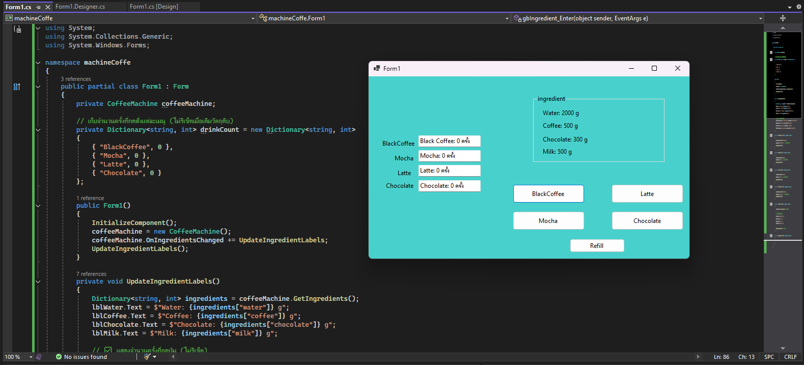

# WinApp-Coffee-Machine

##  User Interface  

##  รายละเอียดโปรแกรม  
โปรแกรมนี้จำลอง **เครื่องชงกาแฟอัตโนมัติ** ที่สามารถเลือกเมนูต่างๆ ได้ ได้แก่  
- Black Coffee  
- Mocha 
- Latte
- Chocolate
- Refill
- กดปุ่มเพื่อเลือกเครื่องดื่ม และระบบจะหักวัตถุดิบอัตโนมัติ  
- แสดงปริมาณวัตถุดิบแบบเรียลไทม์  
- นับจำนวนครั้งที่สั่งแต่ละเมนู  

 ## Class Diagram
 ---CoffeeMachine---
 - ingredients   
 - recipes       
 - OnIngredientsChanged
 +GetIngredients()  
 + MakeDrink()       
 + RefillIngredients()
  ---Form1---
- coffeeMachine: CoffeeMachine 
- drinkCount: Dictionary
+ UpdateIngredientLabels()  
+ btnBlackCoffee_Click()    
+ btnMocha_Click()          
+ btnLatte_Click()          
+ btnChocolate_Click()      
+ btnRefill_Click()    
อธิบายคลาส
CoffeeMachine → ใช้จัดเตรียมวัตถุดิบและชงเครื่องดื่ม
Form1 → UI ของโปรแกรม มีปุ่มให้เลือกเมนูและแสดงผลที่เลือก
